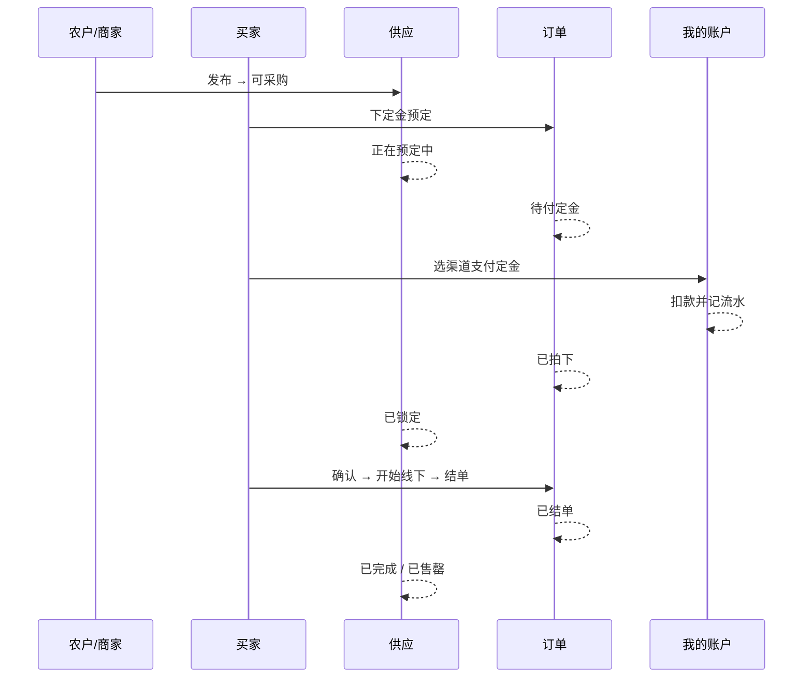

# 百蔬汇用户手册

面向买家、农户与商家的操作说明。按当前已上线流程编写，可与官网「用户操作手册」对照。

**不包含系统后台。** 公开文档不展示任何账号密码。

---

## 1. 平台是什么

百蔬汇连接产地与采购：农户/商家发布可采购供应，买家浏览后下定金预定，再从「我的账户」选择渠道支付；双方确认并线下交割，最后 **结单**（不用「结案」）。

| 入口 | 谁用 | 做什么 |
| --- | --- | --- |
| 用户前台（网页 / Android App） | 买家、农户 | 逛供应、账户支付、我的交易、拍菜地发布 |
| 商家后台（电脑浏览器；手机窄屏同样可用） | 产地商家、档口、合作社 | 发布供应、已拍商品、我的仓库、个人信息 |

官网首页有「一笔交易怎么走」图文、本手册的网页版，以及 Android 安装包下载。

---

## 2. 一笔交易主路径

```text
发布供应（可采购）
  → 买家「下定金预定」（供应：正在预定中；订单：待付定金；账户未扣）
  → 买家选渠道「确认支付定金」（供应：已锁定；订单：已拍下；账户扣款）
  → 提交确认 / 确认（订单：待确认 → 已确认）
  → 开始线下交易（订单：线下进行中）
  → 结单（订单：已结单；供应：已完成或已售罄）
```

未支付超时或取消预定：订单「已取消」，供应回到「可采购」。未扣款则无退款；若已扣款则原渠道退回。

**已拍下 / 待确认** 时，买家或卖家都可以点 **取消**：定金原渠道退回，货重新可采购。待付定金阶段只有买家能取消预定，卖家只能查看。结单后定金划入卖家账户，并按成交额补齐尾款。



---

## 3. 买家：用户前台逐步说明

### 3.1 打开入口

1. 网页：打开官网 →「打开用户前台」。
2. App：官网「App 下载」安装 Android 包，允许未知来源后打开「百蔬汇」。
3. 底部四个 Tab：**逛供应**、**我的交易**、**我的发布**、**我的**。

浏览可不登录。下定金、看账户、跟交易必须登录。

### 3.2 注册与登录

1. 首页点「登录」或「注册」。
2. 注册：用户名、密码、图形验证码（点图片可刷新）。
3. 登录成功后，顶部出现「我的交易」「我的」等入口。

> 演示或测试账号由管理员单独告知，请勿把密码发到聊天、截图或公开页。

### 3.3 逛供应

1. 打开「逛供应」，查看「品类成交排行」和「可购供应」。
2. 读卡片：照片、标题、品类、数量与单价、定金、产地、电话、**状态**。
3. 状态含义：

| 状态 | 能否预定 | 说明 |
| --- | --- | --- |
| 可采购 | 能 | 在售 |
| 正在预定中 | 不能 | 已有人下定金，待对方支付 |
| 已锁定 | 不能 | 定金已付，履约中 |
| 已完成 / 售罄 | 不能 | 已结单 |

4. 自己发布的供应不能自己拍，卡片会提示去「我的发布」。

### 3.4 下定金预定

1. 仅「可采购」显示按钮 **下定金预定**。
2. 点击后：供应 →「正在预定中」；生成订单 →「待付定金」。
3. **此时不扣账户余额**，只占货。
4. 按提示进入「我的交易」去支付。也可点「联系农户」打电话。

### 3.5 我的账户

路径：「我的」→ **我的账户**。

一个账户下挂五个渠道，支付时必须选 **其中一个**，不能拆开扣：

| 渠道 | 说明 |
| --- | --- |
| 系统金额 | 测试/演示用模拟余额 |
| 支付宝 | 模拟渠道 |
| 微信 | 模拟渠道 |
| 银行卡 | 模拟渠道 |
| 信用卡 | 模拟渠道 |

页面展示：合计、各渠道余额、最近流水。测试环境会向「系统金额」注入 **模拟资金**，只为走通扣款，**不是真实资产**，也不接入真实三方支付。

### 3.6 支付定金

1. 「我的交易」切到 **我买到的**，找到「待付定金」订单，点 **去支付**。
2. 核对应付定金、支付截止时间。
3. 选择余额足够的渠道，点 **确认支付定金**。
4. 成功：订单「已拍下」，供应「已锁定」，该渠道余额减少，流水可查。
5. 余额不足：换渠道，或点 **取消预定**（供应回到可采购）。

### 3.7 确认、线下、结单

在「我的交易」按角色推进：买家看 **我买到的**；农户看 **我卖出的**。有的步骤买卖双方都可以点：

| 当前状态 | 买家（我买到的） | 卖家（我卖出的） |
| --- | --- | --- |
| 待付定金 | 去支付 / 取消预定 | 仅查看 |
| 已拍下 | 提交确认、确认、**取消** | 提交确认、确认、**取消** |
| 待确认 | 确认、**取消** | 确认、**取消** |
| 已确认 | 开始线下交易、结单（视按钮） | 同左 |
| 线下进行中 | 结单 | 结单 |
| 已结单 / 已取消 | 只读 | 只读 |

点 **取消**（已拍下 / 待确认）：已付定金原渠道退回，供应回到「可采购」。

结单弹层需 **上传结束图**，并 **勾选是否售罄**（不勾选则供应为已完成）。成交额可按线下过磅修改，不得低于已付定金。结单后：订单「已结单」，供应「已完成」或「已售罄」，官网首页排行会更新。定金划入卖家对应渠道，尾款从买家余额扣给卖家。**尾款不足**时：降低成交额后重试，或买家到「我的账户」点 **测试充值**，测试期也可请管理员在系统后台「用户审核」里 **调账**。若卖家仓库有对应品类库存会自动出库；没有仓或不够则跳过，不挡结单。界面统一叫 **结单**。

建议先电话约定：可采收时间、能否上门、是否过磅、尾款怎么结。

---

## 4. 农户：同一 App 发布

农户与买家共用用户前台，用 Tab「我的发布」。

### 4.1 进入发布

登录 → 底部 **我的发布**（标题「拍菜地，马上卖」）。

### 4.2 拍照填表

1. 菜地/农产品照片，最多 6 张（拍照或相册）。
2. 标题（如「自家红薯白菜待售」）。
3. 品类：从系统字典选择。当前包括红薯、白菜、叶菜、西红柿、土豆、黄瓜、茄子、辣椒、萝卜、大蒜、生姜、玉米，以及 **其他**。
4. 数量、单位、单价、定金（可按约 10% 填写，以你填的为准）。
5. 联系电话（买家会打这个号）、产地、说明（长势、采收时间、能否拉货）。

### 4.3 发布、改货、下架

- **保存草稿**：不上架，买家不可见。
- **发布到百蔬汇**：进入「逛供应」，状态一般为「可采购」。
- 列表里可 **编辑**（改货）、**下架**（可采购 → 已下架）、**上架**（草稿 / 已下架 → 可采购）。
- 正在预定中、已锁定、已结单的货不能改、不能下架。

### 4.4 我卖出的订单

别人下定金后：保持电话畅通；打开「我的交易」切到 **我卖出的**，配合确认、开始线下、结单。不必进商家后台。 **不能拍自己的货。**

- 待付定金：卖家只能看，等买家支付或超时释放。
- 已拍下 / 待确认：可确认，也可点 **取消**（退定金，货回到可采购）。

### 4.5 数据大屏

「我的」→「数据大屏」看自己的在售、预定中、已锁定、草稿、已下架，以及待履约卖出单。点待履约可跳到「我卖出的」。

---

## 5. 商家：电脑后台逐步说明

### 5.1 进入与登录

1. 官网 →「打开商家后台」，或访问站点 `/merchant/`。
2. 输入用户名、密码、图形验证码（点图刷新）。
3. 没有账号：走商家注册，**审核通过后**才能登录。

建议电脑 Chrome / Edge。手机浏览器会变成窄屏：底部 Tab 为 **发布 / 已拍 / 仓库 / 我的**，功能与电脑侧栏相同。

不要用用户前台的采购身份登录商家后台。

### 5.2 发布供应

登录后默认「农户发布供应」：

1. 填写标题、品类、数量、单位、价格、定金、电话、产地、说明。品类与用户前台同一套字典（含土豆、其他等）。
2. 上传菜地照片（可多选，最多 6 张）。
3. 可 **保存草稿** 或 **发布到系统**。成功后右侧「我的发布」出现记录；已发布的用户前台可见「可采购」。
4. 右侧记录可编辑改货、下架、重新上架（预定中 / 已锁定不可改）。

提交中请勿连点。

### 5.3 已拍商品

菜单「已拍商品」跟订单，可按状态、品类、关键词筛选。

状态顺序：待付定金 → 已拍下 → 待确认 → 已确认 → 线下进行中 → 已结单（另有已取消）。

每行可进「商品详情」「交易明细」。按钮随状态出现：提交确认、确认、开始线下交易、结单；**已拍下 / 待确认** 卖家可以点 **取消**（退定金，货回到可采购）。待付定金阶段卖家只能看，等买家支付或超时释放。

### 5.4 我的仓库

「我的仓库」管仓位、库存和出入库，**不是**成交笔数汇总。结单时若仓里有对应品类且数量够，会自动出库；没有仓或不够则跳过，不挡结单。

1. 先 **新建仓位**（如「1 号冷库」），可填备注。
2. 在「出入库」选仓位、品类、单位、数量，方向选 **入库** 或 **出库** 后提交。
3. 「当前库存」按仓位 + 品类显示结余；「出入库流水」可核对历史。
4. 库存不足不能出库。仓位里还有库存时不能删除，需先出空。

手机窄屏底部 Tab「仓库」进入同一页。

### 5.5 个人信息

侧栏「个人信息」（窄屏 Tab「我的」）可：

- 查看用户 ID、用户名、角色、状态（只读）。
- 修改昵称、手机号并保存。
- 用原密码修改新密码（请勿把密码发到公开页或截图）。

### 5.6 供应状态（与前台一致）

可采购 → 正在预定中 → 已锁定 → 已完成 / 售罄。交易会自动推进这些状态；发布方还可对「可采购」下架，对草稿 / 已下架再上架。

---

## 6. 状态对照（便于对界面）

### 6.1 供应

| 界面文案 | 含义 |
| --- | --- |
| 可采购 | 在售，可下定金 |
| 草稿 | 仅自己可见，可继续编辑后上架 |
| 正在预定中 | 已有待付定金 |
| 已锁定 | 定金已付 |
| 已完成 / 售罄 | 已结单 |
| 已下架 | 发布方下架（无进行中单时），可再上架 |

### 6.2 订单

| 界面文案 | 含义 |
| --- | --- |
| 待付定金 | 已预定，未扣款 |
| 已拍下 | 定金已付 |
| 待确认 | 已提交确认 |
| 已确认 | 可约线下 |
| 线下进行中 | 交割中 |
| 已结单 | 闭环 |
| 已取消 | 超时未付 / 取消预定 / 规则允许的取消 |

---

## 7. 常见问题

**别人拍了我的货，在哪确认？**  
用户前台「我的交易」切到 **我卖出的**。农户账号一般不用进商家后台。商家也可在后台「已拍商品」处理。

**逛供应是空的？**  
还没有「可采购」供应。请先用农户 Tab 或商家后台发一条，再刷新。

**点不了下定金？**  
未登录、货不是「可采购」，或这是你自己发的。看卡片提示。

**支付失败？**  
该渠道余额不足。换「系统金额」等有余额的渠道，或取消预定。

**验证码总错？**  
点图片换一张。验证码一次性有效。

**商家发布了，买家看不到？**  
确认状态为「可采购」，两边连同一套服务，买家强制刷新。草稿和已下架不会出现在逛供应。

**定金会退吗？**  
未支付就取消/超时：不扣款，货释放。已拍下 / 待确认时买卖双方取消：原渠道退回，流水可查。结单后定金划给卖家，并补扣尾款，不再退回买家。

**仓库出不了库 / 删不了仓位？**  
出库数量不能大于该仓位该品类的当前库存。仓位还有库存时不能删除，先出空再删。

**品类列表没有我想要的？**  
选 **其他**，并在标题或说明里写清具体品种。

**手机怎么进商家后台？**  
用浏览器打开 `/merchant/`，窄屏底部是发布、已拍、仓库、我的。完整操作仍建议用电脑。

---

## 8. 修订

| 日期 | 说明 |
| --- | --- |
| 2026-08-18 | 结单弹层可改成交额、上传结束图、勾选售罄；尾款不足可测试充值或管理员调账 |
| 2026-08-17 | 结单：定金划转卖家并补尾款；有仓则自动出库；行情历史/实时；改密作废登录 |
| 2026-08-16 | 农户改货/草稿/下架；我卖出的订单；数据大屏改为在售与待履约；品类走字典 |
| 2026-08-15 | 按已上线流程编写：预定与支付分离、我的账户、结单；不含系统后台 |
